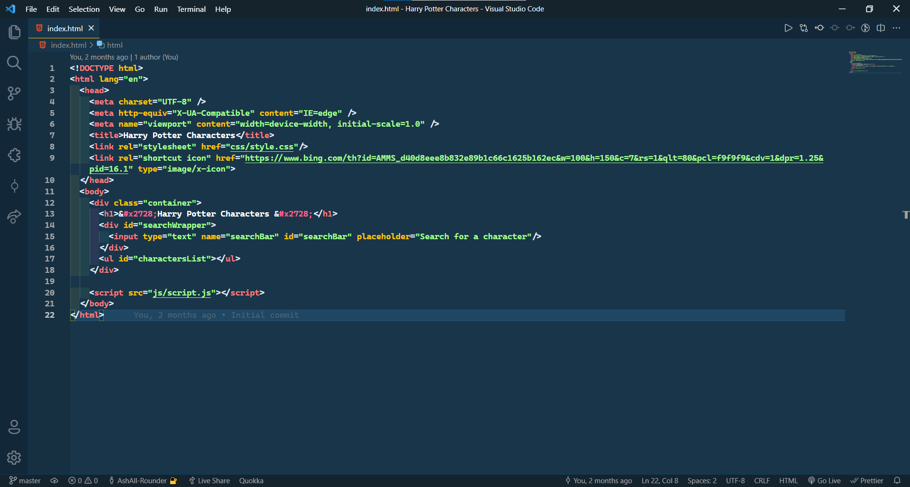
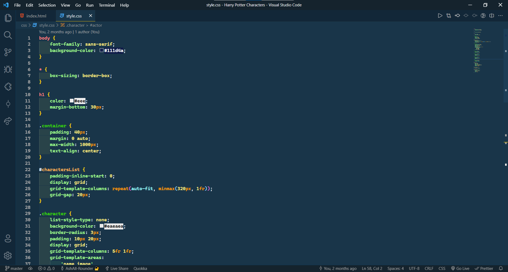
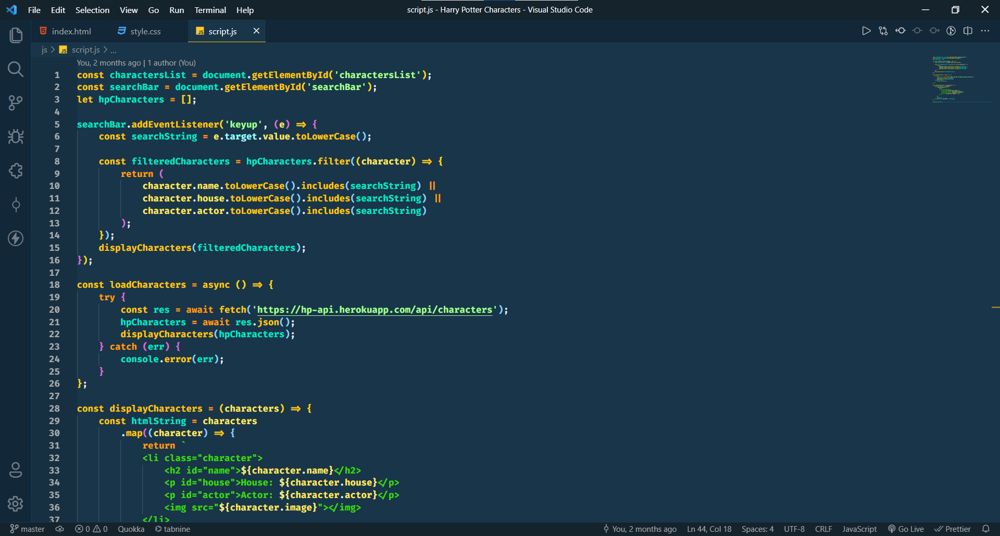

# Cool Breeze Theme For Visual Studio Code

## Demo

### HTML

### CSS

### JavaScript

## Thank You For Checking Out My Theme
This Theme Is Inspired By Cobalt 2 Theme.

## Installation
1. Open the extensions sidebar on Visual Studio Code
2. Search for Cool Breeze Theme
3. Click Reload if prompted to reload your editor
4. Select Cool Breeze in the popup
5. 🌟🌟🌟🌟🌟 Rate five-stars 😃

## Visit My [YouTube Channel](https://youtube.com/channel/UCD313aBTrexHU9JrkqypCsA)

## Issues & Suggestions
For any issues or suggestions, please use [Github Issues](https://github.com/AshAll-Rounder/cool-breeze/issues)

**Enjoy!**